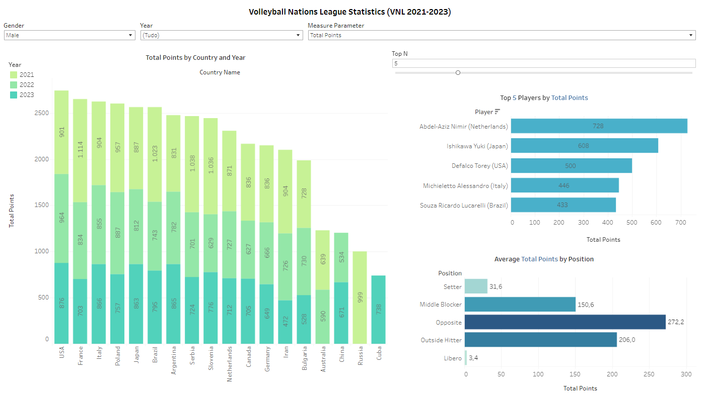

# Volleyball Nations League Data Analysis

This repository contains the code and resources for the data analysis project on the Volleyball Nations League (VNL) seasons from 2021 to 2023. The dataset used is [The 2021-2023 VNL Player Dataset](https://www.kaggle.com/datasets/zakirpasha/the-2021-2023-vnl-player-dataset/data)

Here is a sample visualization:

You can find the Tableau visualizations [here](https://public.tableau.com/app/profile/luiza.perin/viz/VNL2021-2023/Dashboard3).

## Project Overview

The primary goal of this project was to clean, transform, and analyze the dataset using dbt and BigQuery, and to visualize the results in Tableau. The analysis focused on key statistics such as total points by country and year, average points by position and year, and top players by various metrics (attack points, block points, serve points and total points).

## Tools and Technologies

- **dbt**: Used for data transformation and modeling.
- **BigQuery**: Used as the data warehouse for storing and querying the data.
- **Tableau**: Used for data visualization.

## Project Structure

The project is structured as follows:

### Data Cleaning and Staging

The raw dataset was imported into BigQuery. The data cleaning process involved creating staging models in SQL using dbt to ensure the data was clean and standardized.

### Data Modeling

After cleaning the data, models were created in SQL to combine the data from the female and male tables. These combined models enabled a unified analysis across genders.

### Analysis Models

Three main analysis models were created:

1. **Total Points by Country and Year**: This model calculates the total points scored by each country for each year.
2. **Average Points by Position and Year**: This model calculates the average points scored by players in each position for each year.
3. **Top Players by Metric**: This model identifies the top players based on various performance metrics (attack points, block points, serve points and total points)

### Data Visualization

The results from the analysis models were visualized using Tableau. The visualizations provide insights into the performance trends over the three VNL seasons.
